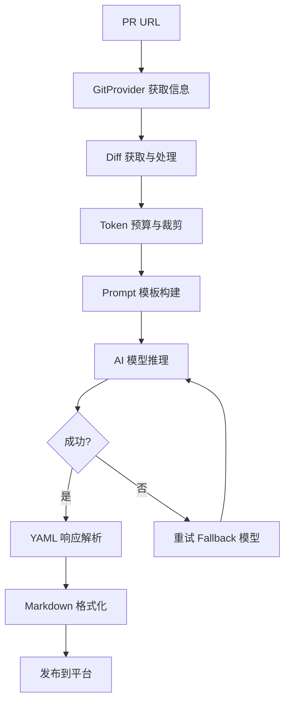

# PR-Agent 代码审查实现机制

## 1. 核心流程 (Main Flow)



**入口**: `pr_agent/tools/pr_reviewer.py::PRReviewer.run()`

## 2. 审查触发方式

### 2.1 手动触发
- **CLI**: `pr-agent --pr_url=<URL> review`
- **PR 评论**: 在 PR 中评论 `/review` 或 `/review -i` (增量审查)

### 2.2 自动触发
- **GitHub Action**: 配置 `.github/workflows/` 中的 workflow
- **配置选项**:
  ```toml
  [github_app]
  handle_pr_actions = ['opened', 'reopened', 'ready_for_review', 'review_requested']
  handle_push_trigger = true  # 检测新提交
  push_commands = ["/describe", "/review"]
  ```

### 2.3 增量审查 (`/review -i`)
- 仅审查自上次 review 以来的新提交
- 显示起始点: `⏮️ Review for commits since [commit_link]`
- 配置阈值决定何时触发

## 3. Diff 处理机制 (`pr_agent/algo/pr_processing.py`)

### 3.1 Token 预算与裁剪

```python
from pr_agent.algo.token_handler import TokenHandler

token_handler = TokenHandler(
    git_provider.pr,
    vars_dict,              # PR 元数据
    system_prompt,
    user_prompt
)

# Token 限制配置
max_description_tokens = 500
max_commits_tokens = 500
max_model_tokens = 32000
```

**裁剪策略**:

```python
# 1. 按 token 数降序排列文件
sorted_files = sorted(lang['files'], key=lambda x: x.tokens, reverse=True)

# 2. 超过限制时裁剪
if total_tokens + new_patch_tokens > max_model_tokens - SOFT_THRESHOLD:
    if large_patch_policy == "clip":
        patch = clip_tokens(patch, delta_tokens)
    elif large_patch_policy == "skip":
        continue  # 跳过此文件
```

### 3.2 Diff 扩展 (Context 增强)

```python
extend_patch(
    original_file_content_str,  # 原始文件内容
    patch,                      # git diff patch
    patch_extra_lines_before=5,  # 配置: 可调至 10
    patch_extra_lines_after=1,   # 新增行后上下文
    filename,
    new_file_str                # 新文件内容
)
```

**动态上下文扩展**:
```toml
[config]
allow_dynamic_context=true              # 启用
max_extra_lines_before_dynamic_context=10  # 向上查到函数/类边界
```

### 3.3 Diff 格式化

**处理删除代码**:
```python
patch = handle_patch_deletions(
    patch,
    original_file_content,
    new_file_content,
    filename,
    edit_type  # ADDED, DELETED, MODIFIED, RENAMED
)
# 移除仅包含删除的 hunk (因为审查关注新代码)
```

**添加行号**:
```python
patch = decouple_and_convert_to_hunks_with_lines_numbers(
    patch,
    file  # FilePatchInfo
)
```

**输出格式**:
```diff
## File: 'src/example.py'

__new hunk__  # 新代码 (带行号,用于引用)
12  def process_data(data):
13  +  result = transform(data)
14  +  if result is None:
15  +      return default_value()
16  return result

__old hunk__  # 删除的代码 (不带行号,仅作参考)
- def process_data(data):
-     return data
```

## 4. AI 推理机制 (`pr_reviewer.py::_get_prediction()`)

### 4.1 Prompt 模板构建 (Jinja2)

**System Prompt** (`settings/pr_reviewer_prompts.toml`):
```jinja2
You are PR-Reviewer, a language model designed to review a Git Pull Request (PR).
Your task is to provide constructive and concise feedback for PR.
The review should focus on new code added in PR code diff (lines starting with '+')

The output must be a YAML object equivalent to type $PRReview:
======

class Review(BaseModel):
    score: str = Field(description="Rate this PR on a scale of 0-100")



class Review(BaseModel):
    security_concerns: str = Field(description="Does this PR code introduce vulnerabilities?")


class PRReview(BaseModel):
    review: Review
======
```

**User Prompt**:
```jinja2
--PR Info--
Title: '{{title}}'
Branch: '{{branch}}'

PR Description:
=====
{{ description|trim }}
=====

The PR code diff:
=====
{{ diff|trim }}
=====


Here are questions to better understand PR:
{{ question_str|trim }}

User answers:
'{{ answer_str|trim }}'
=====


Response (should be a valid YAML, and nothing else):
```yaml
```

### 4.2 可配置字段

| 字段 | 配置键 | 类型 | 说明 |
|------|---------|------|------|
| 评分 | `require_score_review` | bool | 0-100 分数 |
| 测试检查 | `require_tests_review` | bool | yes/no |
| 审查工作量 | `require_estimate_effort_to_review` | bool | 1-5 (简单→复杂) |
| 安全审计 | `require_security_review` | bool | 漏洞检测 |
| PR 拆分 | `require_can_be_split_review` | bool | 可拆分为独立 PR |
| TODO 扫描 | `require_todo_scan` | bool | 代码中的 TODO |
| 时间估算 | `require_estimate_contribution_time_cost` | bool | 最佳/平均/最差情况 |
| Ticket 合规 | `require_ticket_analysis_review` | bool | 需求满足度 |

### 4.3 Fallback 机制

```python
async def retry_with_fallback_models(f, model_type=ModelType.REGULAR):
    all_models = _get_all_models(model_type)  # ["gpt-5", "o4-mini"]

    for model, deployment_id in zip(all_models, all_deployments):
        try:
            get_settings().set("openai.deployment_id", deployment_id)
            return await f(model)  # 尝试推理
        except Exception as e:
            get_logger().warning(f"Failed with {model}: {e}")
            if last_model:
                raise Exception(f"All models failed")
```

**配置**:
```toml
[config]
model="gpt-5-2025-08-07"
fallback_models=["o4-mini"]
model_reasoning="o4-mini"  # 推理专用模型
model_weak="gpt-4o"          # 简单任务弱模型
```

## 5. 响应解析 (`pr_reviewer.py::_prepare_pr_review()`)

### 5.1 YAML 解析与修复

```python
data = load_yaml(
    prediction.strip(),
    keys_fix_yaml=[
        "ticket_compliance_check",
        "estimated_effort_to_review_[1-5]:",
        "security_concerns:",
        "key_issues_to_review:",
        "relevant_file:", "relevant_line:", "suggestion:"
    ],
    first_key='review',
    last_key='security_concerns'
)
```

**修复的常见问题**:
- 缺少冒号
- 缩进错误
- 列表项格式不对
- 缺少引号

### 5.2 输出数据结构

```yaml
review:
  # 核心字段 (始终存在)
  key_issues_to_review:  # 0-num_max_findings 个
    - relevant_file: "src/service/user.py"
      issue_header: "Possible Bug"  # 1-2 词标题
      issue_content: "Null check missing before calling method"
      start_line: 12
      end_line: 14

  # 可选字段 (根据配置启用)
  estimated_effort_to_review_[1-5]: 3  # 🔵🔵🔵⚪⚪
  score: 89
  relevant_tests: "yes" / "no"
  security_concerns: "No" / "SQL injection: ..."
  todo_sections:
    - relevant_file: "src/api.py"
      line_number: 45
      content: "Fix authentication flow"
  can_be_split:
    - relevant_files: ["src/auth.py", "src/user.py"]
      title: "Implement authentication system"
  ticket_compliance_check:
    - ticket_url: "JIRA-123"
      ticket_requirements: |
        - User login
        - Password reset
      fully_compliant_requirements: |
        - User login
      not_compliant_requirements: |
        - Password reset
      requires_further_human_verification: |
        - UI testing needed
  contribution_time_cost_estimate:
    best_case: "45m"
    average_case: "2h"
    worst_case: "5h"
```

## 6. Markdown 格式化 (`pr_agent/algo/utils.py::convert_to_markdown_v2()`)

### 6.1 Emoji 映射

```python
emojis = {
    "Key issues to review": "⚡",
    "Score": "🏅",
    "Security concerns": "🔒",
    "Relevant tests": "🧪",
    "Can be split": "🔀",
    "Todo sections": "📝",
    "Estimated effort to review": "⏱️",
    "Contribution time cost estimate": "⏳",
    "Ticket compliance check": "🎫",
}
```

### 6.2 关键问题格式化

```python
for issue in key_issues_to_review:
    # 提取相关代码行
    relevant_lines_str = extract_relevant_lines_str(
        end_line, files, relevant_file, start_line, dedent=True
    )
    # 返回: ```python\ncode\n```

    # 生成可点击的行链接
    reference_link = git_provider.get_line_link(
        relevant_file, start_line, end_line
    )
    # GitHub: https://github.com/org/repo/blob/branch/file.py#L12-L14

    # GFM: 可折叠的 details 标签
    if gfm_supported and reference_link:
        issue_str = f"""
<details>
<summary>
<a href='{reference_link}'>**{issue_header}**</a>
</summary>

{issue_content}

```python
{relevant_lines_str}
```
</details>
"""
```

### 6.3 审查工作量可视化

```python
value_int = int(estimated_effort)  # 1-5
blue_bars = '🔵' * value_int
white_bars = '⚪' * (5 - value_int)
# 输出: 3 🔵🔵🔵⚪⚪
```

### 6.4 最终输出示例

```markdown
## PR Reviewer Guide 🔍

<table>
<tr><td>⚡&nbsp;<strong>Recommended focus areas for review</strong><br><br>

<details><summary><a href='https://github.com/org/repo/blob/main/service.py#L12-L14'>**Possible Issue**</a></summary>

Null check missing before calling method

```python
def process_user(user_id):
    user = get_user(user_id)
    return user.email  # BUG: user could be None
```
</details>

<tr><td>⏱️&nbsp;<strong>Estimated effort to review</strong>: 3 🔵🔵🔵⚪⚪</td></tr>

<tr><td>🔒&nbsp;<strong>No security concerns identified</strong></td></tr>

<tr><td>🧪&nbsp;<strong>PR contains tests</strong></td></tr>

<tr><td>🏅&nbsp;<strong>Score</strong>: 89</td></tr>
</table>

⚖️ **Ticket Compliance**: ✅ Fully compliant

**[JIRA-123](https://jira.company.com/browse/JIRA-123)** - Fully compliant

Compliant requirements:
- User login implemented
- Password reset flow added

---

<details><summary>💡 Tool usage guide:</summary>

Use `/review` for detailed code review
Use `/improve` for actionable suggestions
Use `/ask` to ask questions
</details>
```

## 7. 发布机制 (`git_providers/git_provider.py`)

### 7.1 发布方式

**普通评论**:
```python
git_provider.publish_comment(markdown_text)
```

**持久化评论** (避免 PR 评论过多):
```python
git_provider.publish_persistent_comment(
    pr_review,
    initial_header=f"{PRReviewHeader.REGULAR.value} 🔍",
    update_header=True,
    final_update_message=final_update_message  # "Review completed ✅"
)
```

**临时状态**:
```python
# 开始时
git_provider.publish_comment("Preparing review...", is_temporary=True)

# 完成后
git_provider.remove_initial_comment()
```

### 7.2 自动打标

```python
# 审查工作量标签
if enable_review_labels_effort:
    git_provider.publish_labels([
        f"Review effort {effort}/5",
        ...existing_labels
    ])

# 安全标签
if security_concerns.lower() not in ['no', 'false']:
    git_provider.publish_labels([
        "Possible security concern",
        ...existing_labels
    ])
```

### 7.3 内联评论 (Inline Comments)

```python
# 检查 provider 能力
if git_provider.is_supported("publish_inline_comments"):
    for issue in key_issues_to_review:
        git_provider.publish_inline_comment(
            body=issue['issue_content'],
            relevant_file=issue['relevant_file'],
            start_line=issue['start_line']
        )
```

**GitHub 实现示例**:
```python
# github_provider.py
def publish_inline_comment(self, body, relevant_file, start_line):
    # 使用 GitHub REST API
    api_url = f"{self.base_url}/repos/{repo}/pulls/{pr_num}/comments"
    data = {
        "body": body,
        "commit_id": self.get_commit_id(relevant_file),
        "path": relevant_file,
        "line": start_line
    }
    requests.post(api_url, json=data, headers=self.headers)
```

## 8. 增量审查机制 (`/review -i`)

### 8.1 触发条件检查

```python
def _can_run_incremental_review(self) -> bool:
    # 条件 1: 新提交数
    num_new_commits = len(self.incremental.commits_range)
    threshold_commits = minimal_commits_for_incremental_review  # 默认 0

    # 条件 2: 时间间隔
    last_commit_date = self.incremental.last_seen_commit.commit.author.date
    threshold_minutes = minimal_minutes_for_incremental_review  # 默认 0
    minutes_passed = (now - last_commit_date).total_seconds() / 60

    # 条件 3: 逻辑 (AND/OR)
    condition = any if not require_all_thresholds_for_incremental_review else all

    return not condition([
        num_new_commits < threshold_commits,
        minutes_passed < threshold_minutes
    ])
```

### 8.2 未审查文件检测

```python
# GitProvider 返回自上次 review 以来修改的文件
if hasattr(self.git_provider, "unreviewed_files_set"):
    if not self.git_provider.unreviewed_files_set:
        git_provider.publish_comment(
            "Incremental Review Skipped\n"
            "No files were changed since previous review"
        )
        return None
```

### 8.3 增量输出

```markdown
## Incremental PR Reviewer Guide 🔍

⏮️ Review for commits since [commit_link]

<table>
...
</table>
```

## 9. 完整配置示例

```toml
[config]
# AI 模型
model="gpt-5-2025-08-07"
fallback_models=["o4-mini"]
temperature=0.2

# Token 限制
max_description_tokens = 500
max_commits_tokens = 500
max_model_tokens = 32000

# Diff 处理
patch_extra_lines_before = 5
patch_extra_lines_after = 1
allow_dynamic_context = true
max_extra_lines_before_dynamic_context = 10
large_patch_policy = "clip"  # 或 "skip"

[pr_reviewer]
# 核心功能开关
require_score_review = false
require_tests_review = true
require_estimate_effort_to_review = true
require_security_review = true
require_can_be_split_review = false
require_todo_scan = false
require_ticket_analysis_review = true
require_estimate_contribution_time_cost = false

# 输出控制
num_max_findings = 3
persistent_comment = true
final_update_message = true
publish_output_no_suggestions = true
enable_help_text = false
enable_intro_text = false

# 标签自动化
enable_review_labels_security = true
enable_review_labels_effort = true

# 增量审查
require_all_thresholds_for_incremental_review = false
minimal_commits_for_incremental_review = 2
minimal_minutes_for_incremental_review = 5

# 额外说明
extra_instructions = """
Focus on:
- Security vulnerabilities
- Performance issues
- Code readability
"""
```

## 10. 扩展特性

### 10.1 Ticket 合规检查

```yaml
review:
  ticket_compliance_check:
    - ticket_url: "JIRA-123"
      ticket_requirements: |
        - Implement login
        - Add password reset
      fully_compliant_requirements: |
        - Login implemented
      not_compliant_requirements: |
        - Password reset missing
      requires_further_human_verification: |
        - UI testing needed
```

**合规等级计算**:
- ✅ **Fully compliant**: 所有 ticket 全部符合
- 🔶 **Partially compliant**: 部分符合
- ❌ **Not compliant**: 存在不合规项
- ✅ **PR Code Verified**: 需人工验证

### 10.2 AI Metadata 增强

```toml
[config]
enable_ai_metadata = true
```

**工作原理**:
1. `/describe` 命令生成文件变更摘要
2. AI 摘要附加到 `diff_files` 的 `ai_file_summary` 字段
3. `/review` 时,摘要插入到每个文件 patch 顶部:

```diff
## File: 'src/service.py'

### AI-generated changes summary:
- Added authentication middleware
- Refactored user service to use dependency injection
- Added error handling for database failures

@@ ... @@
```

### 10.3 Answer Mode

**场景**:
1. 用户执行 `/ask` 询问问题
2. AI 返回问题列表
3. 用户回答问题后执行 `/answer`
4. AI 基于回答提供更精准的 review

**集成到 review**:
```yaml
review:
  insights_from_user_answers: |
    User confirmed this is a breaking change,
    so backward compatibility checks are not needed.
```

### 10.4 多 Provider 支持

**支持的 Git Provider**:
- GitHub ✅
- GitLab ✅
- Bitbucket ✅
- Gitea ✅
- Azure DevOps ✅
- Gerrit ✅

**Provider 能力检测**:
```python
if git_provider.is_supported("gfm_markdown"):
    # 使用 <table>, <details> 等标签

if git_provider.is_supported("publish_inline_comments"):
    # 发布行级评论

if git_provider.is_supported("get_issue_comments"):
    # Answer mode 支持
```

## 11. 最佳实践

### 11.1 Prompt 优化

```toml
[pr_reviewer]
extra_instructions = """
Review should focus on:
1. Security vulnerabilities (SQL injection, XSS, auth issues)
2. Performance bottlenecks (N+1 queries, memory leaks)
3. Code quality (readability, maintainability)
4. Edge cases (null handling, empty inputs)
"""
```

### 11.2 大型 PR 处理

**自动分片** (通过 `/improve --extended`):
```toml
[pr_code_suggestions]
enable_large_pr_handling = true
max_ai_calls = 4  # 分片数量
async_ai_calls = true  # 并发调用
```

### 11.3 Token 优化

```toml
[config]
# 增加 context (但会增加 token 消耗)
patch_extra_lines_before = 10  # 默认 5
allow_dynamic_context = true

# 减少 prompt (腾出空间给 diff)
[pr_reviewer]
extra_instructions = ""  # 最小化
enable_help_text = false
```

## 12. 故障排查

### 12.1 常见问题

**Q: Review 不触发**
- 检查 `ignore_pr_title`, `ignore_pr_labels` 配置
- 检查 GitHub Action 权限
- 查看日志: `LOG_LEVEL=DEBUG`

**Q: Diff 被裁剪**
- 增加 `max_model_tokens`
- 使用 `large_patch_policy = "skip"` 优先重要文件
- 减少 `patch_extra_lines_before/after`

**Q: YAML 解析失败**
- 查看 AI 响应原始内容 (设置 `verbosity_level=2`)
- 检查 `keys_fix_yaml` 是否覆盖常见格式问题

**Q: 增量审查不触发**
- 检查 `minimal_commits_for_incremental_review` 阈值
- 检查 `require_all_thresholds_for_incremental_review` 逻辑
- 确认 provider 支持增量 (`get_incremental_commits`)

### 12.2 调试技巧

```python
# 启用详细日志
[config]
verbosity_level = 2
log_level = "DEBUG"

# 查看当前配置
[config]
output_relevant_configurations = true  # Review 末尾显示配置

# 保存 artifact (用于调试)
get_logger().debug("PR output", artifact=pr_review)
```

## 总结

PR-Agent 的代码审查实现核心是:

1. **结构化 Prompt**: 使用 Pydantic BaseModel 定义 YAML 输出结构
2. **容错解析**: 修复 AI 返回的 YAML 格式问题
3. **模板化渲染**: Jinja2 生成统一的 Markdown 输出
4. **配置驱动**: 所有行为通过 TOML 配置控制
5. **Provider 抽象**: 统一接口适配不同 Git 平台
6. **Fallback 机制**: 主模型失败时自动尝试备用模型

这种设计使得系统高度可配置、可扩展,同时保持输出的一致性和可靠性。
