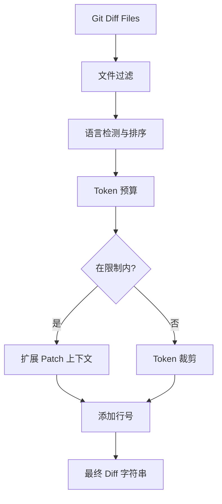

# PR-Agent Diff 处理机制详解

本文档详细阐述 PR-Agent 如何处理 Git Diff，包括 Token 裁剪、动态上下文扩展、格式化等核心机制。

## 目录

1. [整体流程](#1-整体流程)
2. [Token 计算与裁剪](#2-token-计算与裁剪)
3. [动态上下文扩展](#3-动态上下文扩展)
4. [Patch 格式化](#4-patch-格式化)
5. [文件过滤与排序](#5-文件过滤与排序)
6. [完整示例](#6-完整示例)

---

## 1. 整体流程



**核心模块**:
- `pr_agent/algo/pr_processing.py` - 主流程控制
- `pr_agent/algo/token_handler.py` - Token 计算
- `pr_agent/algo/git_patch_processing.py` - Patch 解析与扩展
- `pr_agent/algo/file_filter.py` - 文件过滤
- `pr_agent/algo/language_handler.py` - 语言排序

---

## 2. Token 计算与裁剪

### 2.1 Token 计算机制

#### 2.1.1 TokenEncoder 单例模式

```python
class TokenEncoder:
    _encoder_instance = None
    _model = None
    _lock = Lock()  # 线程安全

    @classmethod
    def get_token_encoder(cls):
        model = get_settings().config.model
        if cls._encoder_instance is None or model != cls._model:
            with cls._lock:  # 加锁确保线程安全
                cls._model = model
                # OpenAI 模型使用 tiktoken
                cls._encoder_instance = encoding_for_model(cls._model) \
                    if "gpt" in cls._model else get_encoding("o200k_base")
        return cls._encoder_instance
```

**特点**:
- 单例模式: 同一模型复用 encoder
- 线程安全: 使用 `threading.Lock()`
- 模型适配: OpenAI 用 `tiktoken`，其他用 `o200k_base`

#### 2.1.2 TokenHandler 初始化

```python
class TokenHandler:
    def __init__(self, pr=None, vars: dict = {}, system="", user=""):
        self.encoder = TokenEncoder.get_token_encoder()

        if pr is not None:
            # 预计算 prompt 的 token 数
            self.prompt_tokens = self._get_system_user_tokens(
                pr, self.encoder, vars, system, user
            )
```

**计算内容**:
```python
def _get_system_user_tokens(self, pr, encoder, vars, system, user):
    # 使用 Jinja2 渲染模板
    environment = Environment(undefined=StrictUndefined)
    system_prompt = environment.from_string(system).render(vars)
    user_prompt = environment.from_string(user).render(vars)

    # 编码并计数
    system_prompt_tokens = len(encoder.encode(system_prompt))
    user_prompt_tokens = len(encoder.encode(user_prompt))

    return system_prompt_tokens + user_prompt_tokens
```

#### 2.1.3 Claude 模型特殊处理

```python
def _calc_claude_tokens(self, patch: str) -> int:
    # Claude 有内容大小限制 (9MB)
    if len(patch.encode('utf-8')) > self.CLAUDE_MAX_CONTENT_SIZE:
        return max_tokens  # 超限返回最大值

    # 调用 Claude API 进行精确计数
    client = anthropic.Anthropic(api_key=get_settings(use_context=False).get('anthropic.key'))
    response = client.messages.count_tokens(
        model=self.CLAUDE_MODEL,
        system="system",
        messages=[{"role": "user", "content": patch}]
    )
    return response.input_tokens
```

#### 2.1.4 精确计算触发条件

```python
def count_tokens(self, patch: str, force_accurate: bool = False) -> int:
    # 快速估算 (tiktoken)
    encoder_estimate = len(self.encoder.encode(patch))

    # 精确计算 (API 调用)
    if force_accurate:
        return self._get_token_count_by_model_type(patch, encoder_estimate)

    # 默认使用估算 (节省时间)
    return encoder_estimate
```

### 2.2 Token 限制配置

```toml
[config]
# Token 阈值
max_description_tokens = 500        # PR 描述的 token 限制
max_commits_tokens = 500            # 提交信息的 token 限制
max_model_tokens = 32000             # 模型最大 token 限制

# 预留 buffer
OUTPUT_BUFFER_TOKENS_SOFT_THRESHOLD = 1500   # 软阈值
OUTPUT_BUFFER_TOKENS_HARD_THRESHOLD = 1000   # 硬阈值

# 模型相关
model = "gpt-5-2025-08-07"
model_token_count_estimate_factor = 0.3   # 估算因子 (1 + 0.3 = 1.3x)
```

**Buffer 作用**:
- **SOFT_THRESHOLD**: 超过此值开始裁剪，保留少量空间
- **HARD_THRESHOLD**: 绝对限制，超过强制停止

**估算因子**: 非官方模型无法精确计数时，用因子增加余量

### 2.3 Token 裁剪策略

#### 2.3.1 完整 Diff 检查

```python
def get_pr_diff(git_provider, token_handler, model, add_line_numbers_to_hunks=False):
    # 生成带扩展的完整 diff
    patches_extended, total_tokens, patches_extended_tokens = \
        pr_generate_extended_diff(
            pr_languages,
            token_handler,
            add_line_numbers_to_hunks,
            patch_extra_lines_before=5,
            patch_extra_lines_after=1
        )

    # 检查是否在限制内
    if total_tokens + OUTPUT_BUFFER_TOKENS_SOFT_THRESHOLD < get_max_tokens(model):
        get_logger().info(f"Tokens: {total_tokens}, under limit: {get_max_tokens(model)}")
        return "\n".join(patches_extended)  # 返回完整 diff
```

#### 2.3.2 裁剪模式 (超过限制时)

```python
# 超过限制，进入裁剪模式
get_logger().info(f"Tokens: {total_tokens}, over limit: {get_max_tokens(model)}, pruning")

patches_compressed_list, total_tokens_list, deleted_files_list, \
    remaining_files_list, file_dict, files_in_patches_list = \
        pr_generate_compressed_diff(
            pr_languages,
            token_handler,
            model,
            add_line_numbers_to_hunks,
            large_pr_handling=False
        )
```

#### 2.3.3 文件排序策略

```python
def pr_generate_compressed_diff(top_langs, token_handler, model, ...):
    # 按语言分组
    for lang in top_langs:
        # 每个语言内按 token 数降序排列
        sorted_files.extend(
            sorted(lang['files'], key=lambda x: x.tokens, reverse=True)
        )

    # 生成每个文件的 patch
    file_dict = {}
    for file in sorted_files:
        patch = handle_patch_deletions(patch, ...)
        patch_tokens = token_handler.count_tokens(patch)
        file_dict[file.filename] = {
            'patch': patch,
            'tokens': patch_tokens,
            'edit_type': file.edit_type  # ADDED, MODIFIED, DELETED
        }
```

**排序优先级**:
1. 语言按总 token 数降序 (主语言优先)
2. 语言内文件按 token 数降序 (大文件优先)

#### 2.3.4 增量填充算法

```python
def generate_full_patch(file_dict, max_tokens_model, remaining_files_list, token_handler):
    total_tokens = token_handler.prompt_tokens  # 初始 token
    patches = []
    remaining_files_list_new = []
    files_in_patch_list = []

    for filename, data in file_dict.items():
        if filename not in remaining_files_list_prev:
            continue

        patch_tokens = data['tokens']

        # 硬停止：无更多空间
        if total_tokens > max_tokens_model - OUTPUT_BUFFER_TOKENS_HARD_THRESHOLD:
            get_logger().warning(f"File skipped, no more tokens: {filename}")
            continue

        # 软阈值：patch 太大时跳过
        if total_tokens + patch_tokens > max_tokens_model - OUTPUT_BUFFER_TOKENS_SOFT_THRESHOLD:
            remaining_files_list_new.append(filename)
            continue

        # 添加 patch
        patches.append(patch_final)
        total_tokens += patch_tokens
        files_in_patch_list.append(filename)

    return total_tokens, patches, remaining_files_list_new, files_in_patch_list
```

**决策逻辑**:
```
当前 Token + Patch Token < 硬阈值 → 添加
当前 Token + Patch Token < 软阈值 → 添加
当前 Token + Patch Token ≥ 软阈值 → 跳过到下一批次
当前 Token ≥ 硬阈值 → 停止
```

#### 2.3.5 大型 Patch 策略

```python
if get_settings().config.get('large_patch_policy', 'skip') == 'skip':
    get_logger().warning(f"Patch too large, skipping: {file.filename}")
    continue  # 完全跳过此文件

elif get_settings().config.get('large_patch_policy') == 'clip':
    delta_tokens = get_max_tokens(model) - OUTPUT_BUFFER_TOKENS_SOFT_THRESHOLD - token_handler.prompt_tokens
    # 裁剪 patch 到剩余 token 空间
    patch_clipped = clip_tokens(
        patch,
        delta_tokens,
        delete_last_line=True,
        num_input_tokens=patch_tokens
    )
    patch = patch_clipped
```

**裁剪函数** (`pr_agent/algo/utils.py`):
```python
def clip_tokens(s, max_tokens, delete_last_line=True, num_input_tokens=None):
    """
    裁剪字符串到指定的 token 数
    """
    # 逐步移除行，直到满足 token 限制
    while len(encoder.encode(s)) > max_tokens:
        lines = s.splitlines()
        if delete_last_line:
            lines = lines[:-1]
        s = '\n'.join(lines)
    return s
```

### 2.4 未处理文件信息

当文件因 token 限制被跳过时，会追加到输出：

```python
# 记录不同类型的未处理文件
added_list_str = "Additional added files (insufficient token budget to process):\n"
modified_list_str = "Additional modified files (insufficient token budget to process):\n"
deleted_list_str = "Deleted files:\n"

# 最终 diff 示例
"""
## File: 'src/main.py'
... (patch 内容)

Additional added files (insufficient token budget to process):
src/utils.py
tests/integration_test.py

Deleted files:
docs/old_feature.md
"""
```

---

## 3. 动态上下文扩展

### 3.1 静态扩展 (Static Context)

```python
extend_patch(
    original_file_str,      # 原始文件完整内容
    patch_str,              # Git diff patch
    patch_extra_lines_before=5,  # 新代码前显示 5 行上下文
    patch_extra_lines_after=1,   # 新代码后显示 1 行上下文
    filename="",
    new_file_str=""          # 新文件完整内容 (用于动态扩展)
)
```

**配置示例**:
```toml
[config]
patch_extra_lines_before = 5   # 默认值 (3行额外 + 2行基础)
patch_extra_lines_after = 1   # 新增代码后的上下文
```

**效果示例**:

原始 patch:
```diff
@@ -12,3 +12,4 @@
 def process_data(data):
-    return data
+    if data is None:
+        return None
+    return data
```

扩展后 (patch_extra_lines_before=5):
```diff
@@ -10,5 +10,7 @@
    # Data processing utilities

 def validate_input(input):
     return input is not None

+def process_data(data):
+    if data is None:
+        return None
+    return data
```

### 3.2 动态扩展 (Dynamic Context)

#### 3.2.1 启用动态扩展

```toml
[config]
allow_dynamic_context = true
max_extra_lines_before_dynamic_context = 10  # 最大向上查找行数
```

**工作原理**: 查找代码结构边界 (函数/类/section)

```python
def process_patch_lines(patch_str, original_file_str, ..., new_file_str=""):
    allow_dynamic_context = get_settings().config.allow_dynamic_context
    patch_extra_lines_before_dynamic = get_settings().config.max_extra_lines_before_dynamic_context

    file_original_lines = original_file_str.splitlines()
    file_new_lines = new_file_str.splitlines() if new_file_str else []

    # 解析 hunk header
    if match:
        section_header, size1, size2, start1, start2 = extract_hunk_headers(match)

        if allow_dynamic_context and file_new_lines:
            # 动态计算上下文边界
            extended_start1, extended_size1, extended_start2, extended_size2 = \
                _calc_context_limits(patch_extra_lines_before_dynamic)

            # 向上查找 section header
            lines_before_original = file_original_lines[extended_start1 - 1:start1 - 1]
            lines_before_new = file_new_lines[extended_start2 - 1:start2 - 1]

            found_header = False
            for i, line in enumerate(lines_before_original):
                if section_header in line:  # 找到边界
                    # 调整起点到边界
                    extended_start1 += i
                    extended_start2 += i
                    extended_size1 -= i
                    extended_size2 -= i

                    found_header = True
                    section_header = ''
                    break

            if not found_header:
                # 未找到边界，回退到静态扩展
                extended_start1, extended_size1, extended_start2, extended_size2 = \
                    _calc_context_limits(patch_extra_lines_before)
```

#### 3.2.2 Section Header 匹配

**检测的模式**:
```python
# 常见的 section header
section_headers = [
    "class ",
    "def ",
    "async def ",
    "interface ",
    "type ",
    "struct ",
    "# ",
    "## ",
    "/// ",
]
```

**匹配规则**:
- 向上扫描 `max_extra_lines_before_dynamic_context` 行
- 找到完全匹配的 section header
- 调整扩展起点到该 header

#### 3.2.3 动态扩展示例

假设配置:
```toml
allow_dynamic_context = true
max_extra_lines_before_dynamic_context = 10
```

**场景 1: 找到函数边界**

原始 patch:
```diff
@@ -25,3 +25,5 @@
+    result = calculate(data)
+    if result is None:
+        return default
+    return result
```

扩展后 (找到函数定义):
```diff
@@ -20,10 +20,12 @@
 def process_user(user_id):
     user = get_user(user_id)
     validate_user(user)
+
+    result = calculate(data)
+    if result is None:
+        return default
+    return result
```

**场景 2: 未找到边界**

```diff
@@ -45,2 +45,3 @@
     value1 = compute(a)
     value2 = compute(b)
+    value3 = compute(c)
```

扩展后 (使用静态扩展 10 行):
```diff
@@ -35,13 +35,14 @@
     # Helper functions

     def compute(x):
         return x * 2

     value1 = compute(a)
     value2 = compute(b)
+    value3 = compute(c)
```

### 3.3 扩展边界检测

```python
def _calc_context_limits(patch_lines_before):
    """
    计算扩展的起点和大小
    """
    extended_start = max(1, start1 - patch_lines_before)
    extended_size = size1 + (start1 - extended_start) + patch_extra_lines_after

    return extended_start, extended_size
```

**边界检查**:
```python
if extended_start - 1 + extended_size > len_original_lines:
    # 不能超出原始文件
    delta_cap = extended_start - 1 + extended_size - len_original_lines
    extended_size = max(extended_size - delta_cap, size1)
```

### 3.4 前后行一致性检查

```python
# 检查扩展区域在原文件和新文件中是否一致
lines_before_original = file_original_lines[extended_start1 - 1:start1 - 1]
lines_before_new = file_new_lines[extended_start2 - 1:start2 - 1]

if delta_lines_original != delta_lines_new:
    # 尝试找最小公共前缀
    found_mini_match = False
    for i in range(len(delta_lines_original)):
        if delta_lines_original[i:] == delta_lines_new[i:]:
            # 从匹配点开始
            delta_lines_original = delta_lines_original[i:]
            delta_lines_new = delta_lines_new[i:]
            extended_start1 += i
            extended_size1 -= i
            found_mini_match = True
            break

    if not found_mini_match:
        # 完全不匹配，不扩展
        extended_start1 = start1
        extended_size1 = size1
```

---

## 4. Patch 格式化

### 4.1 Patch 解析

#### 4.1.1 Hunk Header 正则

```python
RE_HUNK_HEADER = re.compile(
    r"^@@ -(\d+)(?:,(\d+))? \+(\d+)(?:,(\d+))? @@[ ]?(.*)"
)

# 匹配示例:
# "@@ -12,3 +12,5 @@"
# 提取: start1=12, size1=3, start2=12, size2=5, section_header=""
```

#### 4.1.2 提取函数

```python
def extract_hunk_headers(match):
    res = list(match.groups())  # ['-12', '3', '+12', '5', '']
    for i in range(len(res)):
        if res[i] is None:
            res[i] = 0  # 缺失的部分设为 0

    try:
        start1, size1, start2, size2 = map(int, res[:4])
    except:  # "@@ -0,0 +1 @@" 情况
        start1, size1, size2 = map(int, res[:3])
        start2 = 0

    section_header = res[4]  # hunk 后的注释
    return section_header, size1, size2, start1, start2
```

**参数含义**:
- `start1, size1`: 旧文件的起始行和大小
- `start2, size2`: 新文件的起始行和大小
- `section_header`: hunk 的注释信息

### 4.2 删除处理

#### 4.2.1 删除 Hunk 过滤

```python
def omit_deletion_hunks(patch_lines) -> str:
    """
    过滤掉仅包含删除的 hunk
    """
    temp_hunk = []
    added_patched = []
    add_hunk = False
    inside_hunk = False

    for line in patch_lines:
        if line.startswith('@@'):  # 新 hunk 开始
            match = RE_HUNK_HEADER.match(line)
            if match:
                # 结束前一个 hunk
                if inside_hunk and add_hunk:
                    added_patched.extend(temp_hunk)
                temp_hunk = [line]
                add_hunk = False
                inside_hunk = True
        else:
            temp_hunk.append(line)
            # 检查此 hunk 是否包含新增内容
            if line and line[0] == '+':
                add_hunk = True

    # 添加最后一个 hunk
    if inside_hunk and add_hunk:
        added_patched.extend(temp_hunk)

    return '\n'.join(added_patched)
```

**过滤规则**:
- Hunk 中至少有一个 `+` 行才保留
- 纯删除的 hunk 完全移除 (PR 审查关注新代码)

#### 4.2.2 文件删除处理

```python
def handle_patch_deletions(patch, original_file_content_str, new_file_content_str,
                       file_name, edit_type):
    if not new_file_content_str and (edit_type == EDIT_TYPE.DELETED):
        # 整个文件被删除
        patch = None  # 不显示 patch，仅记录文件被删除
    else:
        patch_lines = patch.splitlines()
        patch_new = omit_deletion_hunks(patch_lines)
        patch = patch_new

    return patch
```

**输出示例**:
```python
if patch is None:
    return "\n\n## File 'old_feature.py' was deleted\n"
```

### 4.3 添加行号

#### 4.3.1 格式化函数

```python
def decouple_and_convert_to_hunks_with_lines_numbers(patch: str, file) -> str:
    """
    为每个 hunk 添加行号，区分新旧内容
    """
    patch_with_lines_str = f"\n\n## File: '{file.filename.strip()}'\n"

    new_content_lines = []
    old_content_lines = []

    for line in patch_lines:
        if line.startswith('@@'):
            # 新 hunk，输出之前的行
            if new_content_lines or old_content_lines:
                patch_with_lines_str += format_content_lines(new_content_lines, old_content_lines)
                new_content_lines = []
                old_content_lines = []

        elif line.startswith('+'):
            new_content_lines.append(line)
        elif line.startswith('-'):
            old_content_lines.append(line)
        else:
            # 上下文行 (空格开头)
            new_content_lines.append(line)
            old_content_lines.append(line)

    # 处理最后一个 hunk
    patch_with_lines_str += format_content_lines(new_content_lines, old_content_lines)

    return patch_with_lines_str
```

#### 4.3.2 输出格式

```python
def format_content_lines(new_lines, old_lines, start2, start1):
    patch_str = ''

    # 新内容 (带行号)
    if new_lines:
        patch_str += '\n__new hunk__\n'
        for i, line_new in enumerate(new_lines):
            if not line_new.startswith('+'):
                # 上下文行，移除前缀并添加行号
                patch_str += f"{start2 + i} {line_new}\n"
            else:
                # 新增行，保留 + 号并添加行号
                patch_str += f"{start2 + i} {line_new}\n"

    # 旧内容 (不带行号)
    if old_lines:
        patch_str += '\n__old hunk__\n'
        for line_old in old_lines:
            patch_str += f"{line_old}\n"

    return patch_str
```

#### 4.3.3 最终输出示例

```diff
## File: 'src/service.py'

__new hunk__
25  def get_user(user_id):
26      user = db.query(user_id)
27  +    if user is None:
28  +        raise NotFoundError()

__old hunk__
     def get_user(user_id):
          user = db.query(user_id)
          return user

__new hunk__
32  +    return user
```

**关键特性**:
- `__new hunk__`: 标记新代码段 (带行号)
- `__old hunk__`: 标记旧代码段 (不带行号)
- 行号格式: `行号 代码` (前导空格对齐)
- 保留前缀: `+` 表示新增，` ` ` 表示上下文

### 4.4 Hunks 匹配验证

```python
def check_if_hunk_lines_matches_to_file(i, patch_lines, start1):
    """
    验证 hunk header 与文件内容是否匹配
    """
    is_valid_hunk = True

    # 检查 hunk 后第一行
    if i + 1 < len(patch_lines) and patch_lines[i + 1][0] == ' ':
        if patch_lines[i + 1].strip() != original_lines[start1 - 1].strip():
            # 尝试不同编码
            original_line = original_lines[start1 - 1].strip()
            for encoding in ['iso-8859-1', 'latin-1', 'ascii', 'utf-16']:
                try:
                    if original_line.encode(encoding).decode().strip() == \
                            patch_lines[i + 1].strip():
                        get_logger().info(f"Detected encoding: {encoding}")
                        return False  # 不扩展此 hunk
                except:
                    pass

            is_valid_hunk = False
            get_logger().warning(f"Invalid hunk: line {start1} doesn't match file content")

    return is_valid_hunk
```

**验证目的**: 防止扩展上下文导致 hunk 变无效

---

## 5. 文件过滤与排序

### 5.1 文件过滤

#### 5.1.1 Ignore 模式加载

```python
def filter_ignored(files, platform='github'):
    # 加载正则表达式模式
    patterns = get_settings().ignore.regex
    if isinstance(patterns, str):
        patterns = [patterns]

    # 加载 glob 模式并转换为正则
    glob_setting = get_settings().ignore.glob
    if isinstance(glob_setting, str):
        glob_setting = glob_setting.strip('[]').split(",")
    patterns += translate_globs_to_regexes(glob_setting)

    # 编译所有模式
    compiled_patterns = []
    for r in patterns:
        try:
            compiled_patterns.append(re.compile(r))
        except re.error:
            pass
```

#### 5.1.2 Glob 转正则

```python
def translate_globs_to_regexes(globs: list):
    regexes = []
    for pattern in globs:
        # 使用 fnmatch.translate 转换
        regexes.append(fnmatch.translate(pattern))

        # 支持 **/ 模式 (根目录覆盖)
        if pattern.startswith("**/"):
            regexes.append(fnmatch.translate(pattern[3:]))

    return regexes
```

**转换示例**:
- `*.py` → `.*\.py$`
- `**/*.md` → `.*\.md$` (递归)
- `tests/*` → `tests/.*`

#### 5.1.3 文件过滤执行

```python
# 根据 platform 选择不同的字段
if platform == 'github':
    files = [f for f in files if (f.filename and not r.match(f.filename))]
elif platform == 'gitlab':
    files = [f for f in files if (f['new_path'] and not r.match(f['new_path']))]
elif platform == 'bitbucket':
    files = [f for f in files
              if (f.new and f.new.path and not r.match(f.new.path))]
```

#### 5.1.4 代码生成器过滤

```python
code_generators = get_settings().config.get('ignore_language_framework', [])

for cg in code_generators:
    # 获取该生成器的文件模式
    glob_patterns = get_settings().generated_code.get(cg, [])
    if isinstance(glob_patterns, str):
        glob_patterns = [glob_patterns]

    # 添加到过滤列表
    patterns += translate_globs_to_regexes(glob_patterns)
```

**配置示例**:
```toml
[config]
ignore_language_framework = ["protobuf", "go_gen"]

[generated_code]
protobuf = ["*.pb.go", "*.pb.cc", "*_pb2.py"]
go_gen = ["*.pb.go", "mock_*.go"]
```

### 5.2 语言检测与排序

#### 5.2.1 语言扩展映射

```python
# 加载语言-扩展名映射
language_extension_map_org = get_settings().language_extension_map_org
language_extension_map = {k.lower(): v for k, v in language_extension_map_org.items()}

# 示例映射:
# "python": [".py", ".pyi"]
# "typescript": [".ts", ".tsx"]
# "javascript": [".js", ".jsx"]
```

#### 5.2.2 文件分组

```python
def sort_files_by_main_languages(languages, files):
    # 按语言大小排序
    languages_sorted_list = [
        k for k, v in sorted(languages.items(), key=lambda item: item[1], reverse=True)
    ]

    # 获取主语言的扩展名
    main_extensions = []
    for language in languages_sorted_list:
        lang_key = language.lower()
        if lang_key in language_extension_map:
            main_extensions.append(language_extension_map[lang_key])
```

#### 5.2.3 文件分配

```python
files_sorted = []
rest_files = {}

# 将文件分配到对应语言
for extensions, lang in zip(main_extensions, languages_sorted_list):
    tmp = []
    for file in files_filtered:
        extension_str = f".{file.filename.split('.')[-1]}"
        if extension_str in extensions:
            tmp.append(file)
        else:
            # 未匹配的语言放入 "Other"
            if file.filename not in rest_files:
                rest_files[file.filename] = file

    if len(tmp) > 0:
        files_sorted.append({"language": lang, "files": tmp})

# 添加剩余文件
files_sorted.append({"language": "Other", "files": list(rest_files.values())})
```

#### 5.2.4 排序结果

```python
# 输出结构:
[
    {
        "language": "Python",
        "files": [FilePatchInfo, ...]  # Python 文件
    },
    {
        "language": "JavaScript",
        "files": [FilePatchInfo, ...]  # JavaScript 文件
    },
    {
        "language": "Other",
        "files": [FilePatchInfo, ...]  # 其他文件
    }
]
```

**排序优先级**:
1. 主语言 (文件数最多的语言) → 内部按 token 降序
2. 次要语言 → 内部按 token 降序
3. 其他 → 按 token 降序

### 5.3 扩展名过滤

```python
def filter_bad_extensions(files):
    bad_extensions = get_settings().bad_extensions.default  # [".lock", ".sum", ...]

    # 自动生成的锁文件
    auto_generated_files = [
        'package-lock.json',
        'yarn.lock',
        'composer.lock',
        'Gemfile.lock',
        'poetry.lock'
    ]

    return [
        f for f in files
        if f.filename is not None
        and is_valid_file(f.filename, bad_extensions)
        and not f.filename.endswith(tuple(auto_generated_files))
    ]
```

---

## 6. 完整示例

### 6.1 输入

**PR 包含的文件**:
- `src/service/user.py` (1000 tokens)
- `src/utils/helpers.py` (800 tokens)
- `tests/unit/test_user.py` (600 tokens)
- `docs/api.md` (200 tokens)

**配置**:
```toml
[config]
max_model_tokens = 10000
patch_extra_lines_before = 5
allow_dynamic_context = true
max_extra_lines_before_dynamic_context = 10
```

### 6.2 处理过程

#### 步骤 1: 语言检测
```
Python: 3 files (2400 tokens)
Markdown: 1 file (200 tokens)
```

#### 步骤 2: 文件排序
```
按语言 token 降序:
1. Python (2400 tokens)
2. Markdown (200 tokens)

Python 内部按文件 token 降序:
1. src/service/user.py (1000 tokens)
2. src/utils/helpers.py (800 tokens)
3. tests/unit/test_user.py (600 tokens)
```

#### 步骤 3: Token 计算
```
Prompt tokens: 1500 (system + user)
Diff tokens: 2400
Total: 3900
Limit: 10000
Buffer (SOFT): 1500
Status: Under limit ✅
```

#### 步骤 4: 扩展上下文

**文件**: `src/service/user.py`

原始 patch:
```diff
@@ -15,3 +15,5 @@
 def get_user(id):
     user = db.query(id)
-    return user
+    if not user:
+        raise NotFoundError()
+    return user
```

动态扩展 (找到函数边界):
```diff
@@ -12,8 +12,10 @@
 def validate_user(user):
     return user is not None

 def get_user(id):
     user = db.query(id)
     validate_user(user)
+
+    if not user:
+        raise NotFoundError()
+    return user
```

### 6.3 最终输出

```markdown
## File: 'src/service/user.py'

__new hunk__
12  def validate_user(user):
13      return user is not None
14
15  def get_user(id):
16      user = db.query(id)
17      validate_user(user)
18  +    if not user:
19  +        raise NotFoundError()
20  +    return user

__old hunk__
     def validate_user(user):
          return user is not None

     def get_user(id):
          user = db.query(id)
          validate_user(user)
          return user
```

---

## 7. 调试与优化

### 7.1 调试配置

```toml
[config]
verbosity_level = 2  # 0=静默, 1=警告, 2=详细
log_level = "DEBUG"
output_relevant_configurations = true  # 显示配置信息
```

**日志输出示例**:
```python
# Token 计算
get_logger().info(f"Tokens: {total_tokens}, under limit: {max_tokens}")

# 扩展上下文
get_logger().debug(f"found dynamic context match for section header: def ")

# 文件过滤
get_logger().info(f"Processing file: {filename}, hunks were deleted")
```

### 7.2 性能优化建议

#### 场景 1: 大型 PR

**问题**: Token 超限，过多文件被跳过

**解决方案 1**: 增加限制
```toml
[config]
max_model_tokens = 128000  # 支持更大的上下文
```

**解决方案 2**: 优化扩展
```toml
[config]
patch_extra_lines_before = 3  # 减少上下文
allow_dynamic_context = false  # 禁用动态扩展
```

**解决方案 3**: 使用分片处理
```python
# 通过 /improve --extended 自动分片
[pr_code_suggestions]
enable_large_pr_handling = true
max_ai_calls = 4
```

#### 场景 2: 过多上下文

**问题**: 扩展后 diff 过长，影响聚焦

**解决方案**:
```toml
[config]
patch_extra_lines_before = 0  # 最小扩展
patch_extra_lines_after = 0
allow_dynamic_context = true  # 仅按结构扩展
max_extra_lines_before_dynamic_context = 3  # 限制动态扩展行数
```

#### 场景 3: 敏感文件被忽略

**问题**: 配置文件、测试文件被误过滤

**解决方案**:
```toml
[ignore]
# 使用精确模式
glob = ["node_modules/*", ".venv/*"]

# 避免过于宽泛的模式
regex = ["^config/.*\\.env$"]
```

### 7.3 常见问题排查

| 症状 | 原因 | 解决方案 |
|------|------|---------|
| diff 为空 | 所有文件被过滤 | 检查 `ignore.glob`, `ignore.regex` |
| 行号不匹配 | 编码问题 | 检查文件编码，调整 `get_git_ssl_env` |
| 扩展失效 | Hunk 不匹配文件 | 检查 `patch_extra_lines_before` 设置 |
| Token 计算不准 | 非标准模型 | 调整 `model_token_count_estimate_factor` |
| 动态扩展过多 | `max_extra_lines_before_dynamic_context` 过大 | 减小至 3-5 行 |

---

## 总结

PR-Agent 的 Diff 处理机制核心特点：

1. **智能裁剪**: 按 token 优先级排序，渐进式填充
2. **动态扩展**: 根据代码结构自动扩展上下文
3. **容错验证**: Hunk 匹配验证，编码自动检测
4. **灵活配置**: 所有参数可通过配置调整
5. **详细日志**: 多级日志输出便于调试

这种设计确保了在各种场景下都能生成高质量的 Diff 供 AI 审查使用。
